# MyQuora 

## USER GUIDE ##

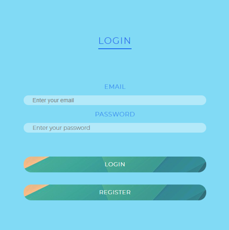

Siteye ilk girildiginde Login ekrani gozukur. Siteye kayitli kisiler email ve password bilgilerini girerek sisteme login olur. Siteye kayitli olmayan kisiler Register butonuna tiklayarak uye olma ekranina gecer.

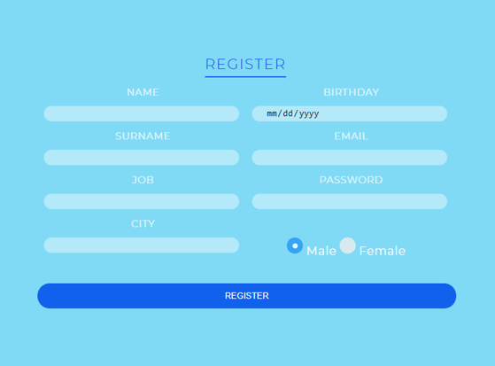
 
Register sayfasinda kisi Name, Surname, Job, City, Birtday,Email,Password ve Cinsiyet bilgilerini girdikten sonra register butonuna basip sisteme kayit olur.

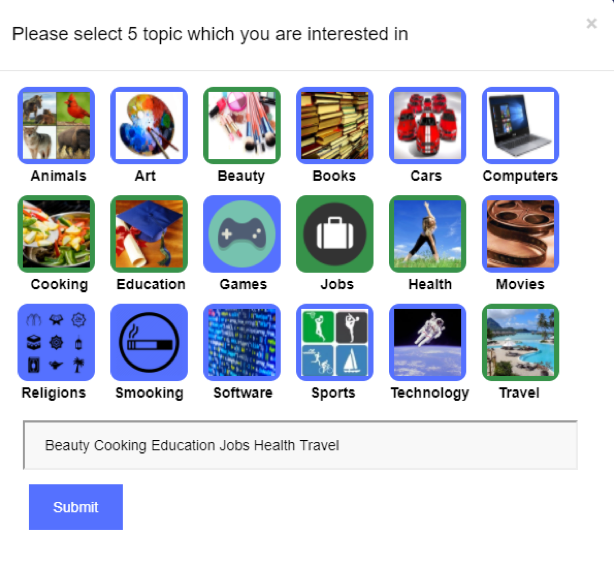

Kisi sisteme kayit olduktan sonra Login ekrani sayfaya gelir ve kisi email ve password bilgilerini girerek sisteme giris yapar. Yeni kayit yapan kullaniciya ilgilendigi en az 5 konu basliginin isaretlenmesi istenir.

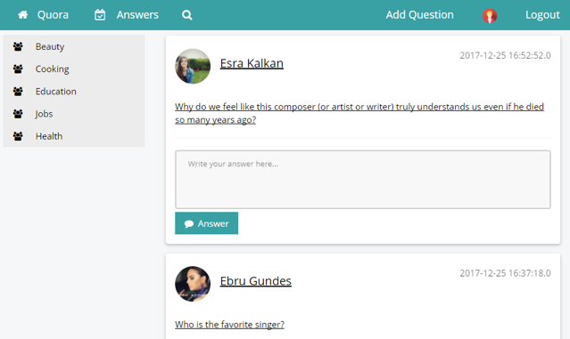

Ilgilenilen konu basliklari secilip submit edildikten sonra kullaniciyi anasayfa karsilar. Anasayfanin ust tarafinda sitenin adi, takip edilen kisilerin ilgilenilen konulardaki sorularin bulundugu Answers, kullanici profillerini aramak icin arama iconu, siteye yeni soru eklemek icin Add Question, kullanicinin profil fotografi ve siteden cikis icin logout butonu bulunmaktadir. Sitenin sol tarafinda ise kullanicinin ilgilendigi konu basliklari bulunmaktadir. Kullanici anasayfada diger kullanicilarin guncel sorularini gormektedir.

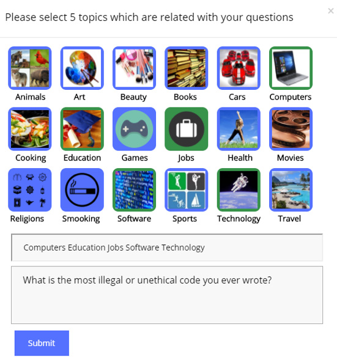

Kullanici siteye soru eklemek icin Add Question`a basar ve kullaniciyi asagidaki ekran karsilar. Kullanici sorusunu yazdiktan sonra, sorunun ilgili oldugu konu basliklarini secip submit eder.

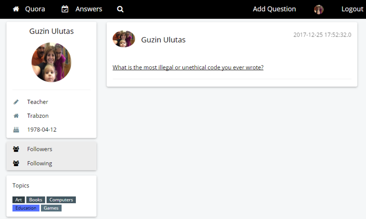

Kullanici soruyu ekledikten sonra sordugu soru profilinde asagidaki sekilde gozukmektedir. Kullanici profilinde kisinin fotografi, meslegi, yasadigi yer, dogum tarihi, takip ettikleri, takipcileri ve ilgilendigi konu basliklari gozukmektedir.

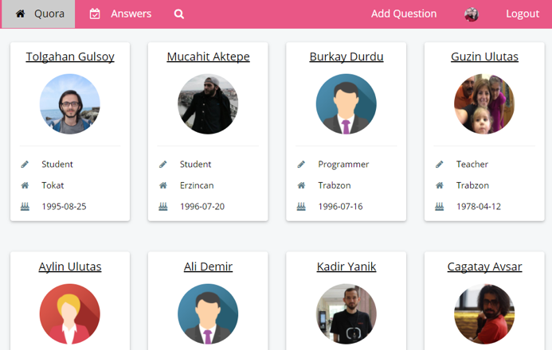

Followers ve Following butonlarina basildiginda ekranda kullanici profilleri gozukmektedir.

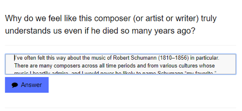

Kullanici, sorulan sorulara cevap vermek cevabini yazar ve Answer butonuna basar.

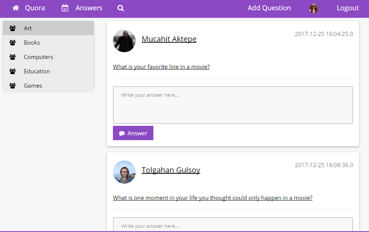

Sol tarafta bulunan konu basliklarina tiklanildiginda konu basligi ile alakali en guncel sorular gozukmektedir. Sorulan sorularin cevaplari soruya tiklanildiginda gozukmektedir.

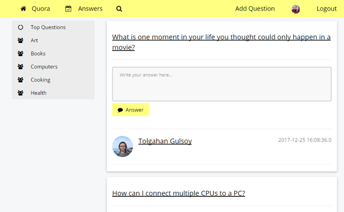

Answers sayfasinda sistemdeki kullanicinin ilgilendigi konularda takip ettigi kisilerin sordugu sorular bulunmaktadir.

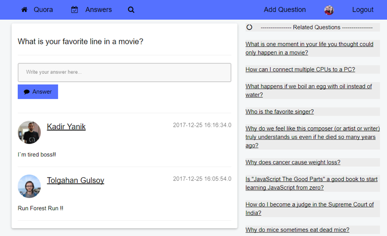

Sorunun ustune tiklandiginda soruya verilen tum cevaplar ve o soruyla benzer sorular Related Questions kisminda bulunmaktadir.

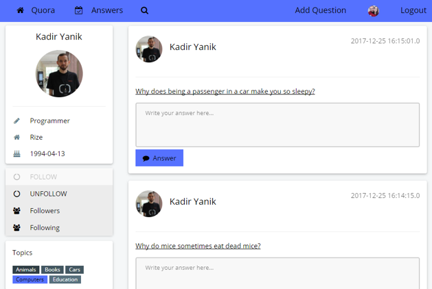

Kullanici diger kullanicin isminin ustune tikladiginda profilini asagidaki sekilde goruntuler. Ayni zamanda follow ve unfollow butonlari ile o kisiyi takip edebilir veya takipten cikarabilir.

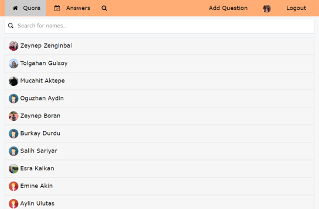

Arama ikonuna basildiginda sitenin kullanicilari gozukmektedir. Girilen harflere gore kullanicilar filtrelenir.

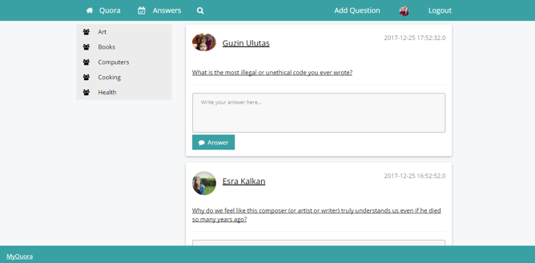

Kullanici sayfanin en alt kisminda bulunan MyQuora linkine tiklandigida sitenin kaynak kodlarini goruntulendigi GitHub sayfasina yonlendirilir.
